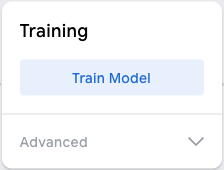

## Train the model Step by step guide

### Add images

--- task ---

Open [Teachable Machine](https://teachablemachine.withgoogle.com/train/image)

--- /task ---

Each class is a category that you want the computer to recognise.
--- task ---

- Rename `Class 1` to `Five` 
- Rename `Class 2` to `Three`

--- /task ---

Gather images of `five` fingers.
--- task ---

- Click **Webcam** in the `Five` class.
- Hold up five fingers to your webcam (make sure your whole hand is in view.)
- With your other hand, press and hold the **Hold to Record** button to gather lots of images.

--- /task ---

Gather images of `three` fingers.

--- task ---

- Click **Webcam** in the `Three` class.
- Hold up three fingers to your webcam (make sure your whole hand is in view.)
- With your other hand, press and hold the **Hold to Record** button to gather lots of images.

--- /task ---

### Train the model

--- task ---

Click `Train Model`

--- /task ---

- Be patient! It can take 10-20 seconds to complete.

### Preview and test

When your model is trained, the preview panel will open.

--- task ---

- Hold up **five** fingers and watch the Output section underneath the preview.

You will see confidence scores for `Five` and `Three`

--- /task ---

--- task ---

- Hold up **three** fingers.
- What is the highest confidence score you can get for Five?
- What is the highest confidence score you can get for Three?

--- /task ---
