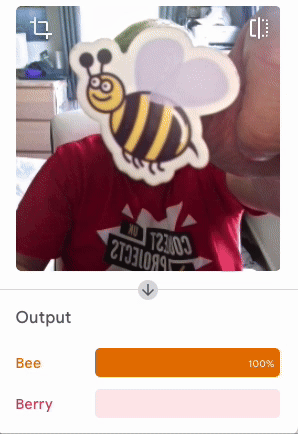
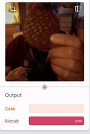

## What can I do next?

Here are some other examples of image classification.

Why not try your own?

### Bee or Berry?
**TODO** Add bee or berry

### Biscuit or cake?

### Resistor recogniser
**TODO** Add resistor recogniser
