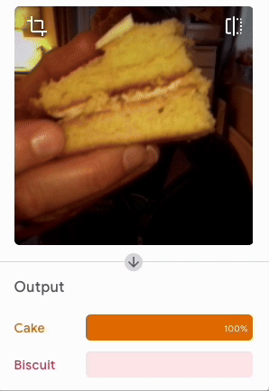

## Challenge
--- challenge ---
Create your own classifier!

### Bee or berry?
--- task ---

I once ate a bee by mistake. Teach a machine to keep you safe!

--- /task ---

### Cake or biscuit?
--- task ---
Settle the argument.

--- /task ---

### Resistor recogniser
--- task ---
Solve a problem for digital makers everywhere!

--- /task ---
--- /challenge ---