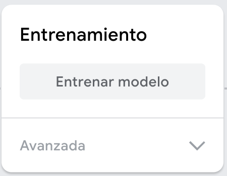

## Entrena el modelo

<html>

<iframe style="position: absolute; top: 0; left: 0; right: 0; width: 100%; height: 100%; border: none;" src="https://www.youtube.com/embed/Sso5cORp1yQ?rel=0&cc_load_policy=1" width="560" height="315" allowfullscreen allow="accelerometer; autoplay; clipboard-write; encrypted-media; gyroscope; picture-in-picture; web-share"></iframe>

</html>

\--- task ---

Haga clic en **Entrenar el Modelo**.

\--- /task ---

**Nota**: ¡Ten paciencia! Puede tardar de 10 a 20 segundos en completarse.

### Vista previa y prueba

Cuando su modelo esté entrenado, se abrirá el panel de vista previa.

\--- task ---

- Levante **cinco** dedos y mire la sección 'Salida' debajo de la vista previa.

Verá el indice de confianza para `Cinco` y `Tres`.

\--- /task ---

\--- task ---

- Levanta **tres** dedos
- ¿Cuál es el indice de confianza más alto que puedes obtener para `Cinco`?
- ¿Cuál es el indice de confianza más alto que puedes obtener para `Tres`?

\--- /task ---
