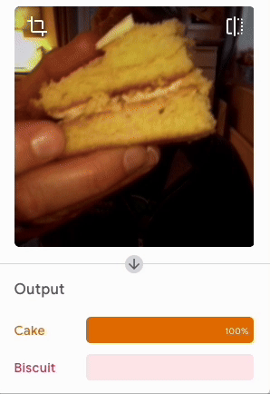

## Desafío

\--- challenge ---

¡Crea tu propio clasificador!

### ¿Abeja o baya?

\--- task ---

Una vez me comí una abeja por error. ¡Enséñale a una máquina a mantenerte seguro!

\--- /task ---

### ¿Pastel o galleta?

\--- task ---

Resolver la discusión.

\--- /task ---

### Reconocimiento de resistencias

\--- task ---

¡Resuelve un problema para los creadores digitales de todo el mundo!

\--- /task ---
\--- /challenge ---
