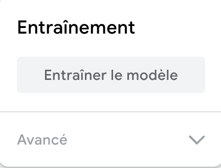

## Entraîner le modèle

<html>

<iframe style="position: absolute; top: 0; left: 0; right: 0; width: 100%; height: 100%; border: none;" src="https://www.youtube.com/embed/Sso5cORp1yQ?rel=0&cc_load_policy=1" width="560" height="315" allowfullscreen allow="accelerometer; autoplay; clipboard-write; encrypted-media; gyroscope; picture-in-picture; web-share"></iframe>

</html>

\--- task ---

Clique sur **Train Model**.

\--- /task ---

**Remarque** : Patience ! Cela peut prendre entre 10 et 20 secondes.

### Prévisualiser et tester

Lorsque ton modèle est entraîné, le panneau d'aperçu s'ouvre.

\--- task ---

- Lève **cinq** doigts et regarde la section « Output » sous l'aperçu.

Tu verras des scores de confiance pour « Cinq » et « Trois ».

\--- /task ---

\--- task ---

- Lève **trois** doigts
- Quel est le score de confiance le plus élevé que tu puisses obtenir pour « Cinq » ?
- Quel est le score de confiance le plus élevé que tu puisses obtenir pour « Trois » ?

\--- /task ---
