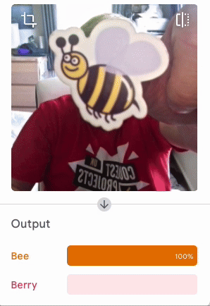

## Sfida

\--- challenge ---

Crea il tuo personaggio!

### Ape o bacca?

\--- task ---

Una volta ho mangiato un'ape per sbaglio. Insegna a una macchina a proteggerti!

\--- /task ---

### Torta o biscotto?

\--- task ---

Sciogliamo ogni dubbio!

\--- /task ---

### Riconoscitore di resistenze

\--- task ---

Risolvi un problema per i maker digitali di tutto il mondo!

\--- /task ---
\--- /challenge ---
