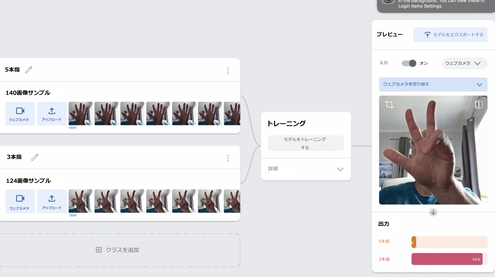

## はじめに

何本の指を上げているかをコンピューターに教えましょう！

\--- collapse ---

---

## title:: 画像はどこに保存されますか？

- このプロジェクトでは「機械学習」と呼ばれる技術が使用されています。 機械学習システムは、大量のデータを使用してトレーニングされます。
- このプロジェクトでは、アカウントの作成やログインは必要ありません。 このプロジェクトでは、モデルの作成に使用する画像サンプルは、ブラウザ（ご使用のマシン上）にのみ一時的に保存されます。
- ウェブカメラからの画像は、このウェブサイトまたは他のウェブサイトに送信されることはありません。

\--- /collapse ---

**ウェブカメラ**が必要になります。

## --- collapse ---

## title:: YouTube はありませんか？ 動画をダウンロードしましょう！

[このプロジェクトのすべてのビデオをダウンロード] (https://rpf.io/p/en/teach-a-machine-go){:target="_blank"} できます。

\--- /collapse ---