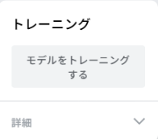

## モデルをトレーニングします

<html>

<iframe style="position: absolute; top: 0; left: 0; right: 0; width: 100%; height: 100%; border: none;" src="https://www.youtube.com/embed/Sso5cORp1yQ?rel=0&cc_load_policy=1" width="560" height="315" allowfullscreen allow="accelerometer; autoplay; clipboard-write; encrypted-media; gyroscope; picture-in-picture; web-share"></iframe>

</html>

\--- task ---

**モデルをトレーニング**をクリックします。

\--- /task ---

**注：** しばらくお待ちください！ 完了まで10秒から20秒ほどかかる場合があります。

### プレビューとテスト

モデルのトレーニングが完了すると、プレビューパネルが開きます。

\--- task ---

- 指を**5本**立てて、プレビューの下にある「出力」セクションを見てください。

「5本指」と「3本指」の信頼度スコアが表示されます。

\--- /task ---

\--- task ---

- 指を**3本**立てます
- 「5本指」で得られる最高の信頼度スコアはいくつですか？
- 「3本指」で得られる最高の信頼度スコアはいくつですか？

\--- /task ---
