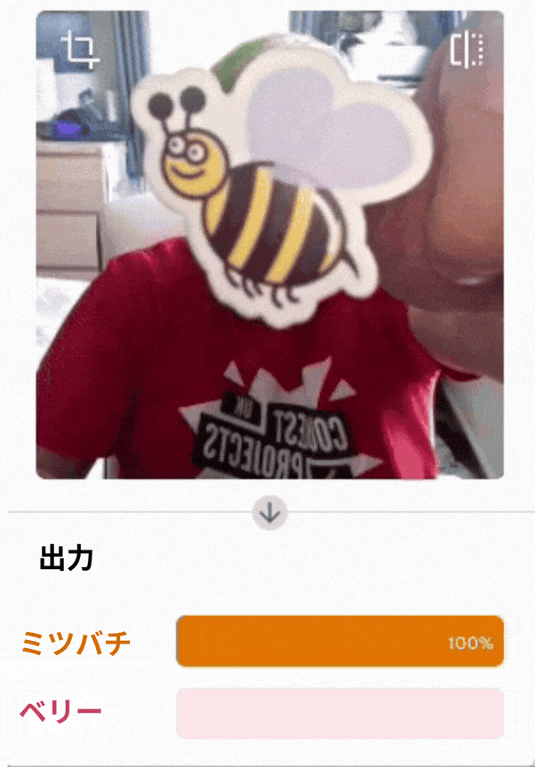
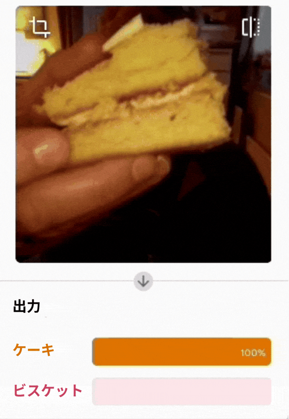
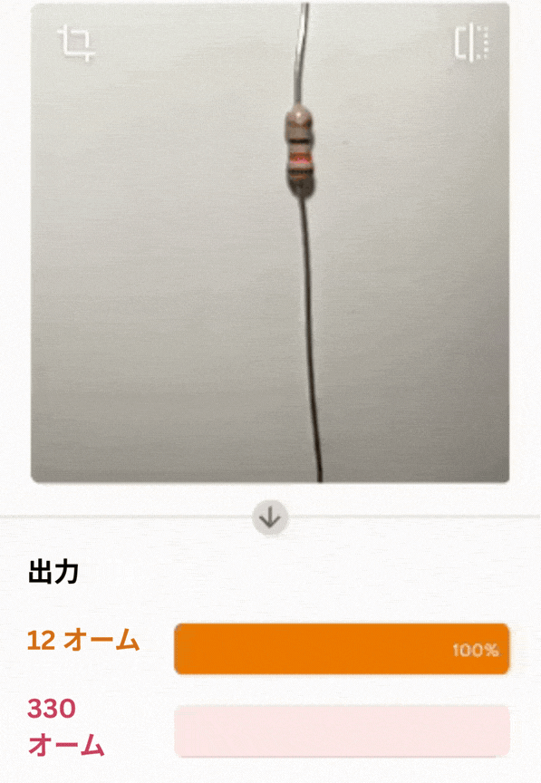

## チャレンジ

\--- challenge ---

自分だけの判別モデルを作ろう！

### ミツバチか、それともベリー？

\--- task ---

一度、間違ってミツバチを食べてしまった。 機械に身を守ってもらう方法を教えよう！

\--- /task ---

### ケーキかビスケットか？

\--- task ---

決着をつけよう。

\--- /task ---

### 抵抗器認識器

\--- task ---

世界中のデジタルクリエイターの悩みを解決しよう！

\--- /task ---
\--- /challenge ---
