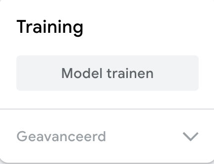

## Train het model

<html>

<iframe style="position: absolute; top: 0; left: 0; right: 0; width: 100%; height: 100%; border: none;" src="https://www.youtube.com/embed/Sso5cORp1yQ?rel=0&cc_load_policy=1" width="560" height="315" allowfullscreen allow="accelerometer; autoplay; clipboard-write; encrypted-media; gyroscope; picture-in-picture; web-share"></iframe>

</html>

\--- task ---

Click **Train Model**.

\--- /task ---

**Note**: Be patient! Het kan 10 tot 20 seconden duren om te voltooien.

### Preview en test

When your model is trained, the preview panel will open.

\--- task ---

- Hold up **five** fingers and watch the 'Output' section underneath the preview.

You will see confidence scores for `Five` and `Three`.

\--- /task ---

\--- task ---

- Hold up **three** fingers
- What is the highest confidence score you can get for `Five`?
- What is the highest confidence score you can get for `Three`?

\--- /task ---
