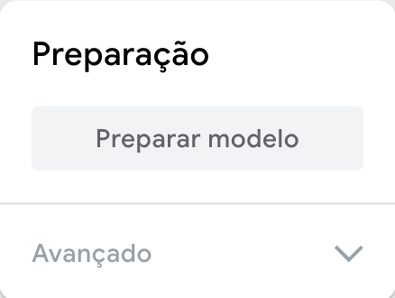

## Treine o modelo

<html>

<iframe style="position: absolute; top: 0; left: 0; right: 0; width: 100%; height: 100%; border: none;" src="https://www.youtube.com/embed/Sso5cORp1yQ?rel=0&cc_load_policy=1" width="560" height="315" allowfullscreen allow="accelerometer; autoplay; clipboard-write; encrypted-media; gyroscope; picture-in-picture; web-share"></iframe>

</html>

\--- task ---

Clique em **Treinar Modelo**.

\--- /task ---

**Observação**: Seja paciente! Pode levar de 10 a 20 segundos para ser concluído.

### Pré-visualizar e testar

Quando seu modelo é treinado, o painel de pré-visualização será aberto.

\--- task ---

- Mostre **cinco** dedos e veja a seção 'Saída' embaixo da pretela.

Você verá índices de confiança para `Cinco` e `Três`.

\--- /task ---

\--- task ---

- Mostre **três** dedos
- Qual é a maior índice de confiança que você pode obter para `Cinco`?
- Qual é a maior índice de confiança que você pode obter para `Três`?

\--- /task ---
