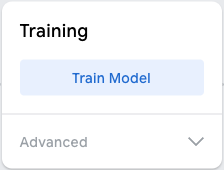

## Treina o modelo

<html>

<iframe style="position: absolute; top: 0; left: 0; right: 0; width: 100%; height: 100%; border: none;" src="https://www.youtube.com/embed/Sso5cORp1yQ?rel=0&cc_load_policy=1" width="560" height="315" allowfullscreen allow="accelerometer; autoplay; clipboard-write; encrypted-media; gyroscope; picture-in-picture; web-share"></iframe>

</html>

--- task ---

Clica em **Modelo preparado**.

--- /task ---

**Nota:** Sê paciente! Pode levar 10 a 20 segundos para completar.

### Pré-visualizar e testar

Quando o modelo estiver treinado, o painel de pré-visualização vai abrir.

--- task ---

- Levanta **cinco** dedos e observa a secção 'Saída' abaixo da pré-visualização.

Vais ver pontuações de confiança para `Cinco` e `Três`.

--- /task ---

--- task ---

- Levanta **três** dedos
- Qual é a maior pontuação de confiança que podes obter para `Cinco`?
- Qual é a maior pontuação de confiança que podes obter para `Três`?

--- /task ---
