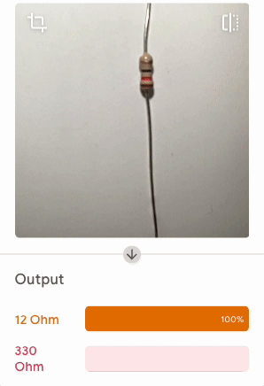

## Desafio

--- challenge ---

Cria o teu próprio classificador!

### Abelha ou framboesa?

--- task ---

Uma vez comi uma abelha por engano. Ensina a máquina a manter-te seguro!

--- /task ---

### Bolo ou bolacha?

--- task ---

Resolve a questão.

--- /task ---

### Reconhecedor de resistências

--- task ---

Resolve um problema para os fabricantes do digital em toda a parte!

--- /task ---
--- /challenge ---
