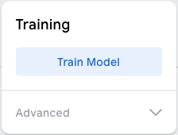

## Навчи модель

<html>

<iframe style="position: absolute; top: 0; left: 0; right: 0; width: 100%; height: 100%; border: none;" src="https://www.youtube.com/embed/Sso5cORp1yQ?rel=0&cc_load_policy=1" width="560" height="315" allowfullscreen allow="accelerometer; autoplay; clipboard-write; encrypted-media; gyroscope; picture-in-picture; web-share"></iframe>

</html>

\--- task ---

Натисни **Train Model** («Навчити модель»).

\--- /task ---

**Примітка**: не поспішай! Навчання може тривати від 10 до 20 секунд.

### Попередній перегляд і тестування

Коли модель закінчить навчання, відкриється панель попереднього перегляду.

\--- task ---

- Піднеси **п’ять** пальців і подивись на панель результатів (Output) під попереднім переглядом.

Ти побачиш, наскільки модель упевнена у своєму передбаченні щодо «п’яти» та «трьох» пальців.

\--- /task ---

\--- task ---

- Піднеси **три** пальці
- Який найвищий відсоток упевненості ти можеш отримати для «П’яти»?
- Який найвищий відсоток упевненості ти можеш отримати для «Трьох»?

\--- /task ---
